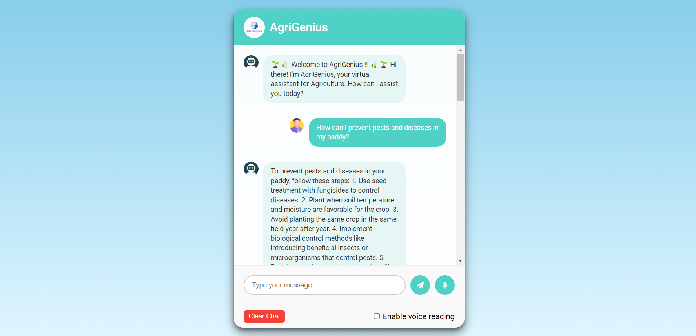

# AgriGenius: AI-Powered Agriculture Chatbot

## Project Overview
AgriGenius: AI-Powered Agriculture Chatbot is a Python web application designed to empower farmers with information accessibility. AgriGenius leverages a Retrieval-Augmented Generation model to address farmer's agricultural queries. The RAG model retrieves the most relevant information from a comprehensive repository of agricultural websites and PDF documents and utilizes that information to generate informative and comprehensive responses tailored to each user's specific question with precise answers.

## Features

- Fetch content from specified websites.
- Extract text from PDF files.
- Initialize a vector store for efficient information retrieval.
- Set up a Retrieval QA chain using a language model to answer queries related to agriculture.
- Web interface to interact with the system.

## Installation

Run the following Commands.

`STEP 1` - Creating virtual enviroment :
To do so:-
```bash
  pip install virtualenv
```
```
  virtualenv env
  .\env\Scripts\activate.ps1
```
----
`STEP 2` - Cloning the Repository :
```
    git clone https://github.com/jayeshbhandarkar/AgriGenius.git
    cd AgriGenius
```
----
`STEP 3` - Installing all the Dependancies :

```
    pip install -r requirements.txt
```
---
`STEP 4` - Run the flask web application
```
    python app.py
```
---
`STEP 5` - Open Web-Browser (Chrome) and navigate to `http://127.0.0.1:5000` to use this web-application.

---
`STEP 6` - Ask questions related to agriculture in the provided input field.

---

## Screenshot
- ### AgriGenius ChatBot Interface


## Additional Notes

- The language model used is meta-llama/Llama-2-70b-chat-hf.
- The application uses the Together API for LLM services.
- Add your own Together API key in the chat2.py file.
  
```
llm = Together(
	model="meta-llama/Llama-2-70b-chat-hf",
	max_tokens=512,
	temperature=0.1,
	top_k=1,
	together_api_key="YOUR_Together_API_KEY"
)
```

- The requirements.txt should include all necessary packages such as Flask, requests, PyPDF2, langchain, chroma, and any other dependencies required by your project.

⬤ Please do ⭐ the Repository, if it helped you in anyway.

### 😊 Thankyou !! ✨
